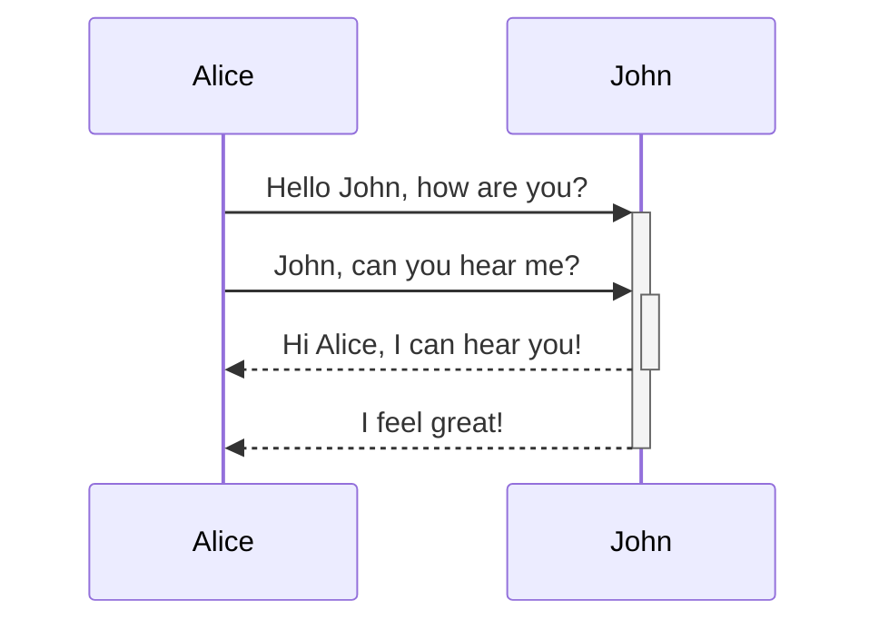

# qrm
Queue Resources Manager

## Build 

[](https://codecov.io/gh/final-israel/qrm)


[](https://pypi.org/project/qrm-client/)
## management server
Add resource to qrm:

```bash
curl --header "Content-Type: application/json" --request POST --data '[{"name": "resource_2", "type": "server"}]'  http://localhost:8080/add_resources
```

Remove resource from qrm:

```bash
curl --header "Content-Type: application/json" --request POST --data '[{"name": "resource_2", "type": "server"}]'  http://localhost:8080/remove_resources
```

Set resource status:

```bash
curl --header "Content-Type: application/json" --request POST --data '{"resource_name": "resource_2", "status": "active"}'  http://localhost:8080/set_resource_status
curl --header "Content-Type: application/json" --request POST --data '{"resource_name": "resource_2", "status": "disabled"}'  http://localhost:8080/set_resource_status
```

Add job to resource:

```bash
curl --header "Content-Type: application/json" --request POST --data '{"resource_name": "resource_1", "job": {"token": 1, "job_name": "foo"}}'  http://localhost:8080/add_job_to_resource

````

Remove job from resources:

```bash
curl --header "Content-Type: application/json" --request POST --data '{"token": 1, "resources": ["resource_1"]}'  http://localhost:8080/remove_job
```


Set server status (control the global qrm state):

```bash
curl --header "Content-Type: application/json" --request POST --data '{"status": "disabled"}'  http://localhost:8080/set_server_status
curl --header "Content-Type: application/json" --request POST --data '{"status": "active"}'  http://localhost:8080/set_server_status
```

Show status of the server with it's resources and their jobs url:
```console
http://127.0.0.1:8080/status
```

## Communication Server
##### Server uptime info:
This web URL will show information about the server. 
```console
http://127.0.0.1:5555/is_server_up
```
##### Is server up API:
```bash
curl http://localhost:5555/is_server_up
Json Response 
{"status": true}
```

### API Version 1
#### To access to version 1 API all API calls must end with the suffix "/v1"
example: /new_request -> /new_request/v1


#### New_request:
```bash
curl --header "Content-Type: application/json" --request POST --data '{"names": [{"names": ["r1"], "count": 1}], "tags": [], "token": "token1234"}'  http://localhost:8080/new_request/v1
```
#### Get token status:
```bash
curl --header "Content-Type: application/json"  http://localhost:8080//get_token_status/v1?token=<token>
```
#### Cancel token:
```bash
curl --header "Content-Type: application/json" --request POST --data '{"token": "token1234"}'  http://localhost:8080/cancel_token/v1
```

## How it works
